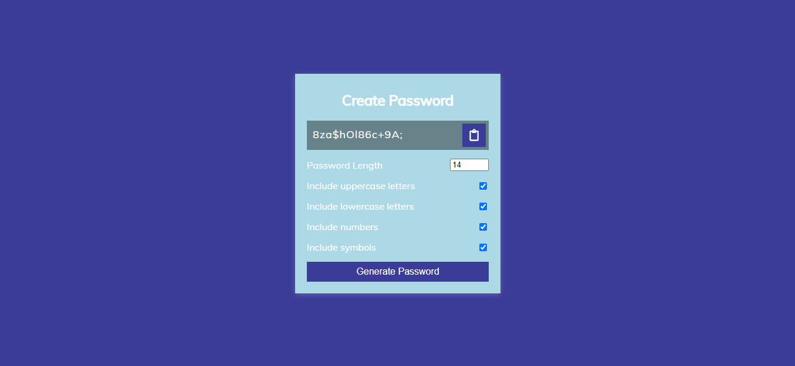
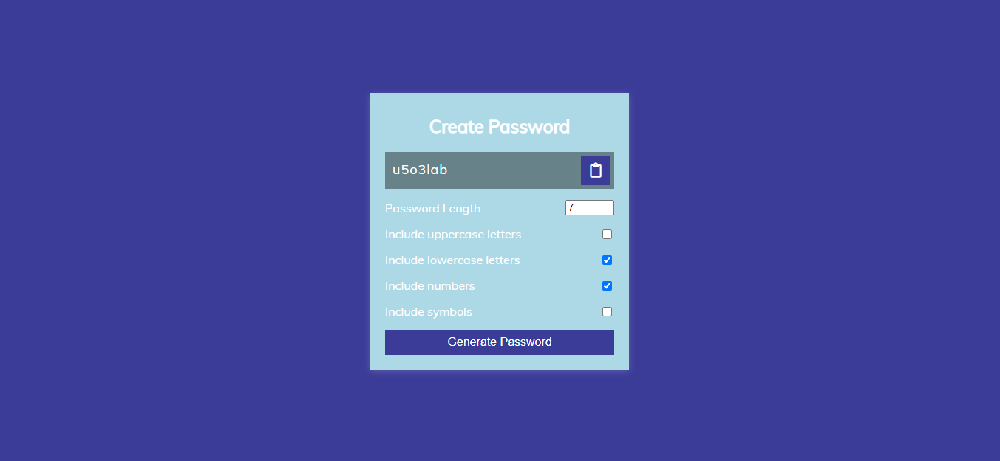

# PRANAV MATHUR

## Learnings from the project:

- Using **String.fromCharCode()** to convert ASCII characters to string
- Inbuilt JS methods like _Math.floor_, _Math.random_ and _Object.keys()_

## Time taken:

    It took me 6 hours to complete this project.

## Screenshots:

## Live link:

[Go to site](https://10-password-generator.netlify.app/)
